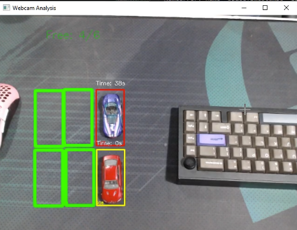
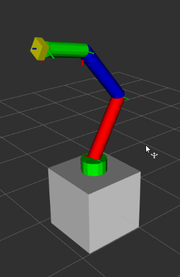

# Vitor Domeniquelli Chagas

Mestrando em Ciência da Computação Aplicada na **UFABC**, pesquisando robótica no laboratório **IARA++** sob orientação do Prof. Mateus Coelho Silva. Minha pesquisa foca em odometria, gêmeos digitais e sistemas multi-robô com ROS 2.

Sou voluntário no **IEEE RAS UFABC**, onde ensino robótica para iniciantes (projeto RobotIEEE, 1º lugar no IEEE Brazil Council SAC Awards 2024), e professor da fase de Eletrônica no **Outcome School**, programa online de robótica voltado a jovens de baixa renda nos EUA.

Antes do mestrado, trabalhei com P&D em consultoria (G.A.C.) e no setor bancário (Itaú), e realizei intercâmbio acadêmico no **Shibaura Institute of Technology**, Japão.

---

📧 vitor.domeniquelli@gmail.com &nbsp;|&nbsp;
[GitHub](https://github.com/vitor-domeniquelli) &nbsp;|&nbsp;
[LinkedIn](https://www.linkedin.com/in/vitor-domeniquelli)

---

## Projetos em Destaque

### Gêmeo Digital — Rocket Tank (ROS 2)

Sistema de gêmeo digital para um robô de esteira de baixo custo, com odometria off-MCU validada por câmera overhead com marcadores ArUco. Artigo em submissão para periódico IEEE.

**[Leia mais](projetos/digital-twin-rocket-tank.md)**

---

### Detector de Vagas com Visão Computacional

Sistema em Python e OpenCV que analisa imagens para identificar em tempo real a ocupação de vagas de estacionamento.

**[Leia mais](projetos/detector-de-vagas.md)**

---

### Simulação de Braço Robótico com ROS

Simulação de um braço robótico utilizando ROS 2, com controle de juntas e visualização via RViz.

**[Leia mais](projetos/braco-robotico-ros.md)**

---

### Sistema de Ground Truth com ArUco e Raspberry Pi

Sistema de câmera embarcada para rastreamento de robôs em tempo real via marcadores ArUco, integrado como nó ROS 2.

**[Leia mais](projetos/camera-ground-truth.md)**
