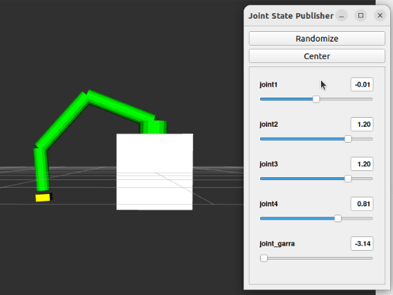

# Projeto: Simulação de Braço Robótico com ROS

## Visão Geral

Este projeto apresenta o desenvolvimento e simulação de um robô manipulador acoplado a uma cadeira de rodas (WMRA – Wheelchair Mounted Robotic Arm), voltado ao apoio de pessoas com deficiência motora.

O objetivo foi criar uma prova de conceito em ambiente virtual utilizando o ROS 2, explorando desde a modelagem cinemática até o controle e visualização do robô.

Tecnologias Utilizadas: ROS 2, RViz, URDF (Unified Robot Description Format), Método de Denavit-Hartenberg.

Demonstração:
<iframe width="560" height="315" src="https://www.youtube.com/embed/QyZOEk0ngec?si=FNkyaON1kp5UcOHu" title="YouTube video player" frameborder="0" allow="accelerometer; autoplay; clipboard-write; encrypted-media; gyroscope; picture-in-picture; web-share" referrerpolicy="strict-origin-when-cross-origin" allowfullscreen></iframe>

## Problema Abordado
No Brasil, 7,8 milhões de pessoas têm dificuldade para andar ou subir degraus (IBGE, 2019).
Apesar de existirem braços robóticos comerciais, como o JACO (Kinova Robotics) e o FRIEND (Universidade de Bremen), esses dispositivos ainda são caros e pouco acessíveis.

A pesquisa busca alternativas de baixo custo que possam ser integradas a cadeiras de rodas, ampliando a autonomia e a qualidade de vida de pessoas com mobilidade reduzida.

## Solução Proposta
O projeto consistiu em modelar e simular um robô manipulador simples, controlado virtualmente em um ambiente ROS 2. A estrutura foi dividida em quatro etapas principais:

Modelagem (URDF): 

* Definição dos elos e juntas do robô usando formas geométricas básicas (caixas e cilindros).
* Configuração de parâmetros de inércia, geometria e orientação.
* Implementação da base fixa representando a cadeira de rodas.

Cinemática (DH):

* Aplicação do método Denavit–Hartenberg para calcular a cinemática direta.
* Criação das matrizes de transformação homogênea para descrever o movimento das juntas.

Simulação (ROS 2 + RViz):

* Criação de um pacote ROS 2, com visualização 3D no RViz.
* Controle das juntas via Joint State Publisher.

## Resultados e Aprendizados
Foi obtida uma simulação funcional do robô manipulador acoplado à cadeira de rodas, com controle interativo das juntas.
O modelo validou os princípios de modelagem e cinemática de manipuladores em ROS 2.
A experiência permitiu desenvolver competências práticas em robótica, como:

* Criação e configuração de pacotes ROS 2.
* Estruturação de robôs no formato URDF.
* Aplicação de conceitos de cinemática direta e Denavit–Hartenberg.
* Visualização e depuração de modelos 3D em RViz.

## Recursos do Projeto

*   **Relatório (Modelo Paper UFABC)**: [Report [PDF]](../archives/sim-robo-ros-rel.pdf)
*   **Apresentação do Projeto**: [Presentation [PDF]](../archives/sim-robo-ros-presentation.pdf)
*   **Deduções Denavit–Hartenberg**: [DH Model [PDF]](../archives/sim-robo-ros-ded.pdf)